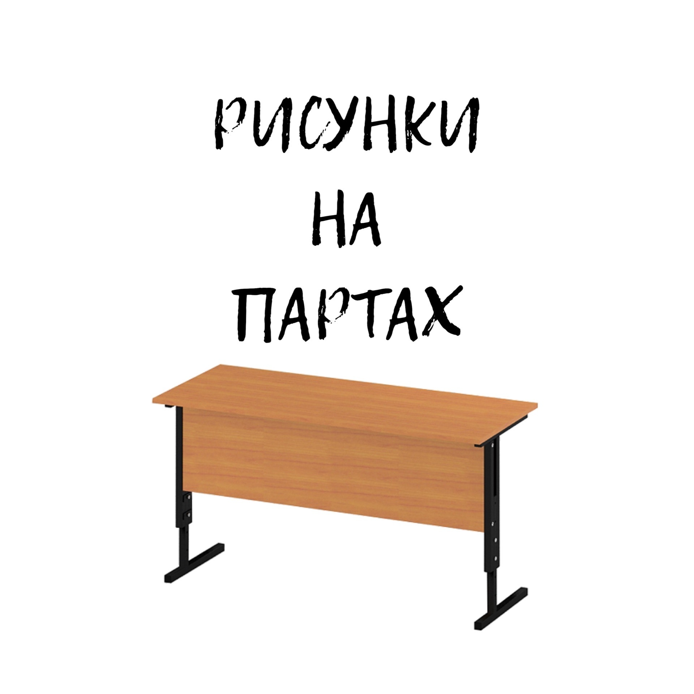
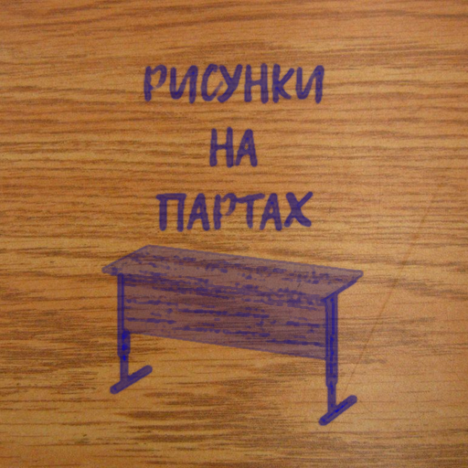

# Рисунки на Партах Бот

Бот сделанный мною в 2020 для одного тематического сообщества ВКонтакте. Вот так бот обработал его логотип:

1. **Было**
  
2. **Стало**
  

Бот использует OpenCV и sharp для обработки изображений и запускался он на платформе [Yandex Cloud Function](https://cloud.yandex.ru/services/functions)